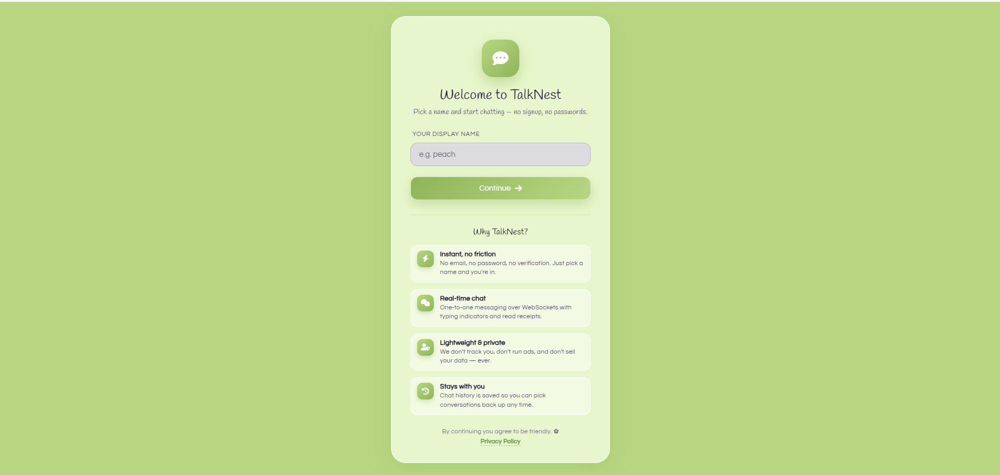
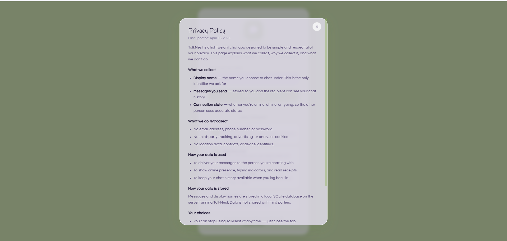
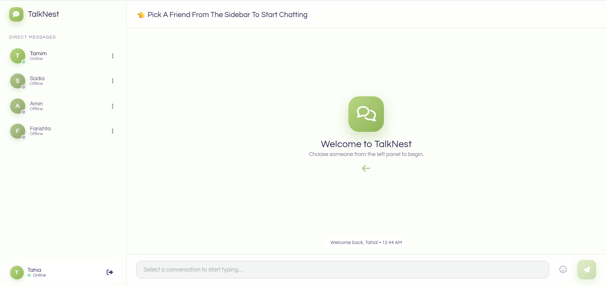
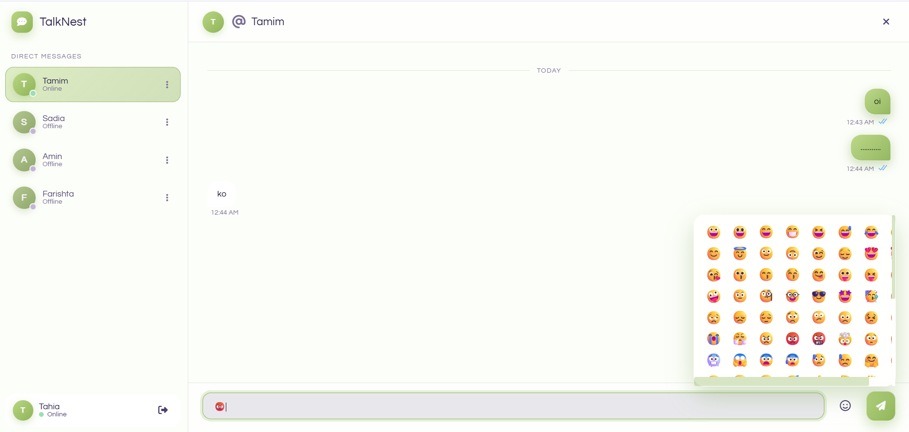
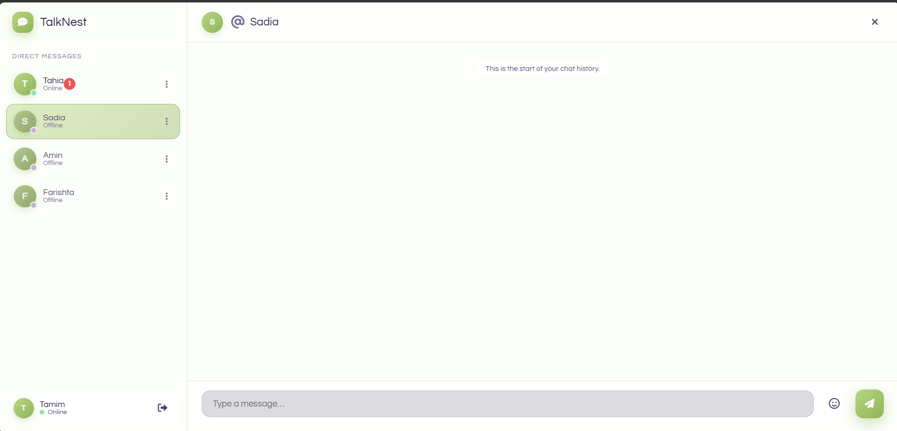
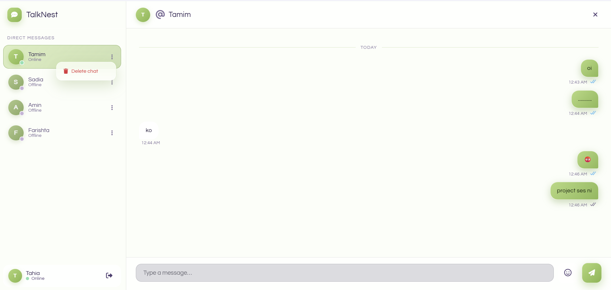

# TalkNest

A real-time one-to-one chat app built with **Flask** + **Flask-SocketIO** + **SQLite**, featuring a fullscreen pastel glassmorphic frontend.

No passwords, no signup — pick a display name and start chatting.

---

## Features

- One-to-one (unicast) messaging over WebSockets
- Online / offline user list, broadcast on connect/disconnect
- Persistent chat history (SQLite)
- Read receipts (sent / read ticks)
- Typing indicator
- Date dividers in chat history
- Emoji picker (110+ emojis)
- Pastel glassmorphism UI, Questrial Google font
- Session-based name (no auth) — `/login` then `/chat`

---

## Tech stack

| Layer    | Tool                                |
| -------- | ----------------------------------- |
| Backend  | Python 3, Flask, Flask-SocketIO     |
| Storage  | SQLite (`chat.db`)                  |
| Realtime | Socket.IO (4.0.1) over WebSockets   |
| Frontend | Vanilla JS (modular), CSS, Jinja2   |
| Font     | [Questrial](https://fonts.google.com/specimen/Questrial) |
| Icons    | Font Awesome 6                      |

---

## Preview


*Simple, frictionless login — just pick a display name.*


*Clear, accessible privacy policy and data usage information.*


*Clean glassmorphic interface with online/offline user presence.*


*Real-time messaging featuring read receipts, timestamps, and an emoji picker.*


*Background unread message badges to keep you updated.*


*Context menus for easy conversation management.*

---

## Project structure

```text
CN-Project/
├── app.py                       # Flask app + SocketIO handlers + routes
├── chat.db                      # SQLite database (auto-created)
├── README.md
├── static/
│   ├── style.css                # Pastel glassmorphism theme
│   └── js/
│       ├── state.js             # Shared App namespace (socket, state)
│       ├── utils.js             # Time/date/DOM helpers
│       ├── users.js             # registerUser, openChat, user list
│       ├── messages.js          # sendMessage, history, receive
│       ├── typing.js            # Typing indicator handlers
│       ├── emoji.js             # Emoji picker
│       └── main.js              # Boot + DOM event wiring
└── templates/
    ├── login.html               # /login — name picker card
    ├── index.html               # /chat — shell that includes partials
    └── partials/
        ├── sidebar.html         # User list + bottom user panel
        └── chat.html            # Header + messages + input + emoji
